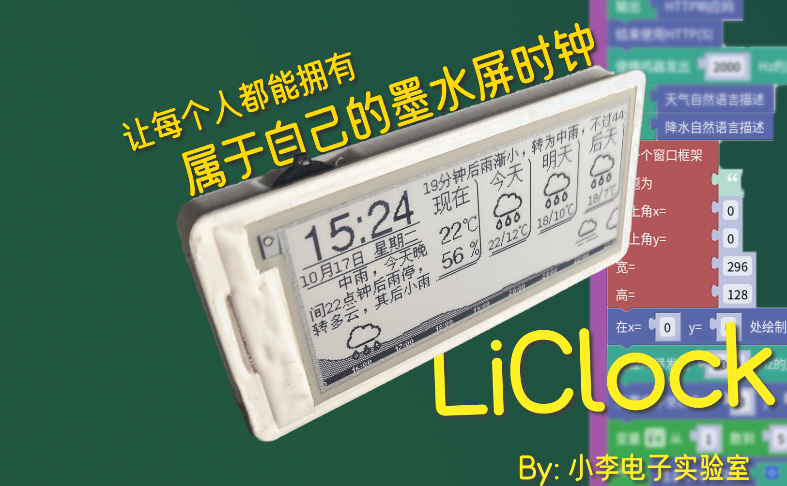
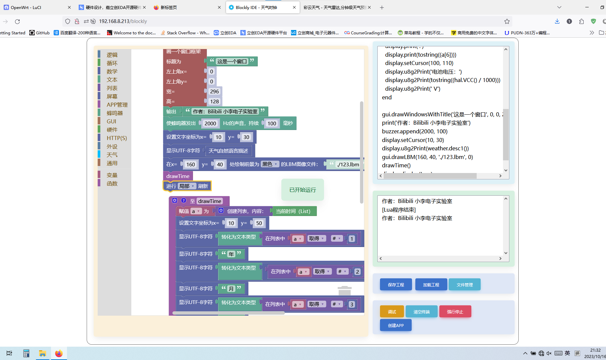

# 
LiClock 墨水屏天气时钟

## 停更预告  
对我（up主）来说，这个项目只是一个参赛作品（立创星火计划），相对其它项目来说，我认为我应该提供更多的技术支持  
但实际我并不需要这样一个墨水屏时钟，因为宿舍桌子太小，只能摆一些必需品  
图形化编程环境我也完全用不到，但我却花了一半以上的时间来移植这一功能  
现在临近星火计划截止，我也看到了很多（我认为）比我优秀很多的项目，从点赞收藏量看，它们已经超过我很多了  
因此我认为这个项目有很大可能无法获奖  
也就是说，我的全部投入对我来说，很可能没有任何好处  
诚然，看到大家的复刻成功的消息，我也为他们感到开心  
但没有一个DIY爱好者能做到，花时间在一个自己用不上，而且对自己没有任何好处的项目上这么久  
（**我写这些并不是希望大家捐赠，我也没有开通任何捐赠入口**）  
我最近也想了一个新项目（国内没人做过，国外开源界没人做完过），大概需要三到四个月全部完成，  
（因为一些特殊原因，这个新项目不会开源，最多只是发个视频）  

即日起，本项目暂停更新，直到2023年12月31日，但对当前版本在任何平台，继续提供力所能及的技术支持  
如果项目获奖，我将视情况提供半年到一年的更新  
否则，我将归档（Archive）此仓库，并停止任何相关技术支持  
像《校园生活助手7》项目一样，作为一个练手项目看待吧  

毕竟，相比于闭源的墨水屏项目，它确实太简陋了  

### 
一种兼具易用性与扩展性的多功能墨水屏天气时钟 

## 
硬件购买注意事项
屏幕型号：`E029A01`  
ESP32：wroom或者其它封装和引脚兼容的模组，建议Flash选大一点  
### **尽量不要买esp32-solo-1，虽然能用，但价格没有任何优势，除非用拆机件**  
其它照着BOM买就行，买之前请认真阅读开源平台下面的DIY注意事项  
### 淘宝购买链接[请看Wiki](https://github.com/diylxy/LiClock/wiki/%E5%85%83%E5%99%A8%E4%BB%B6%E8%B4%AD%E4%B9%B0)
---
## 
软件使用说明

### 程序烧录[请看Wiki](https://github.com/diylxy/LiClock/wiki/%E5%9B%BA%E4%BB%B6%E7%83%A7%E5%BD%95)  

### 手动编译固件[请看Wiki](https://github.com/diylxy/LiClock/wiki/%E6%89%8B%E5%8A%A8%E7%BC%96%E8%AF%91%E5%9B%BA%E4%BB%B6)  

---
### 拨轮开关使用说明
|  按键   | 短按功能  | 长按功能 |
|  ----  | ----  | ---- |
| 左键  | 输入数字/时间：当前位-1 | 返回上个App 输入数字/时间：光标右移 电子书：上一页 |
| 右键  | 输入数字/时间：当前位+1 | 输入数字/时间：光标右移 电子书：下一页|
| 中键  | 确认 | 重置输入为默认值 |
---
### 点此查看[Lua App编写规范](src/lua/README.md)  

## 
Blockly
~~因为现在的Lua语言与Blockly并未完全适配，有些“积木”后续会进行修改，其中包括：~~  

### Blockly使用教程  
暂无，挂一张照片在这吧  

## 
其它
### midi转buz[请看Wiki](https://github.com/diylxy/LiClock/wiki/midi%E8%BD%ACbuz)  

### 图像转lbm[请看Wiki](https://github.com/diylxy/LiClock/wiki/%E5%9B%BE%E5%83%8F%E8%BD%AClbm)  

## 
 开源协议
### 因为用了彩云天气的API，仅供学习研究，如果需要商用，则不得包含此源代码或由其产生的二进制文件  
### 本项目src路径下的代码没有使用其它任何与墨水屏相关的项目代码  
源代码开源协议为**GPL-3.0**，允许开源情况下商用，但请标明原作者和工程链接，不得售卖源代码或作为闭源项目发布  
另外，按照GPL-3.0协议要求，由此项目衍生出的代码也需要以GPL3.0开源  
此处的开源指使任何人可以自由且免费地获得、修改**源代码**和（或）**硬件工程源文件**  
